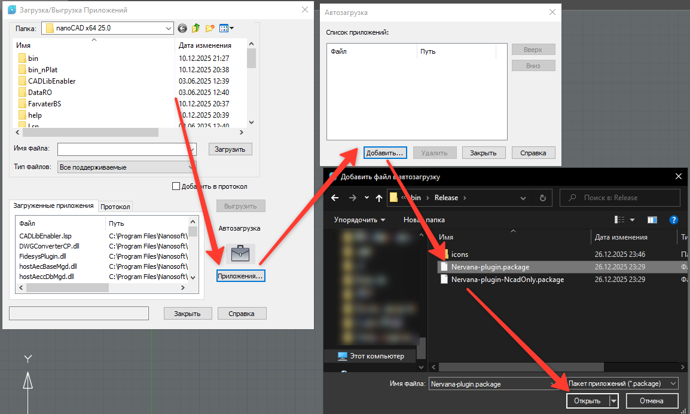

# Установка плагина

Последняя версия плагина [доступна по ссылке](https://github.com/GeorgGrebenyuk/Nervana-nbims-plugin/releases/latest). Скачайте архив с именем `Nervana-app.zip` и распакуйте себе на ПК.

Плагин распространяется в трех конфигурациях -- будучи устанавливаемым на nanoCAD BIM Строительство, на ModelStudio CS и на платформу nanoCAD. Под каждую из конфигураций имеются свои файлы конфигурации (package), описывающие интерфейс и набор загружаемых библиотек. Вам необходимо добавить в автозагрузку Вашего nanoCAD (команда `APPLOAD`) нужный package-файл:

- для nanoCAD BIM Строительство: `Nervana-plugin-NcBIMs.package`;

- для ModelStudio CS: `Nervana-plugin-NcCOM.package`;

- для платформы nanoCAD: `Nervana-plugin-Nc.package`;
