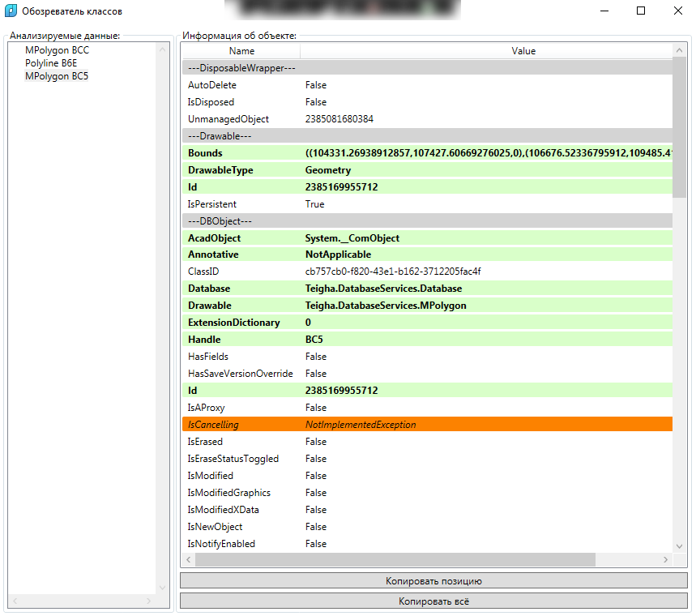
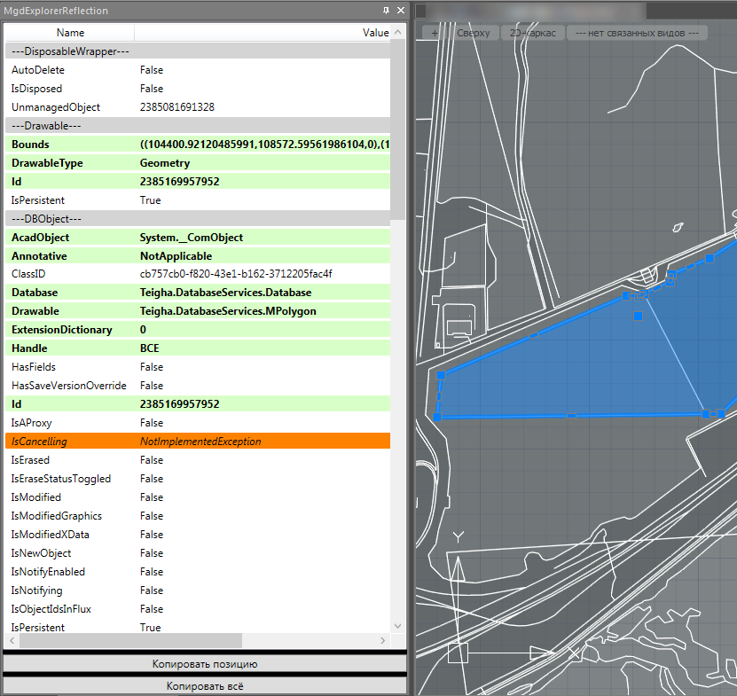

# Группа команд "Обозреватель Reflection"

*Доступно с версии 1.0.0*

Команды представляют собой окна с отображением информации о классах соответствующих объектов включая наследуемые классы. Это скорее "технические" функции, крайне-полезные для разработчиков. Кроме того, они позволяют лучше понять внутреннее устройство САПР. По умолчанию, используется следующий перечень библиотек для анализа объектов:

> "hostmgd.dll", "hostdbmgd.dll", "imapimgd.dll", "mapibasetypes.dll", "mapimgd.dll", "hostPointCloudsMgd.dll", "ncBIMSmgd.dll"

Расширить перечень объектов в данной версии можно только вручную, отредактировал тэг MgdLibraries в конфиг-файле 

`%APPDATA%\Nervana nanoCAD plugin\Configs\MgdExplorerReflectionConfig\Default.xml`

## Принцип использования

После вызова любой из функций, кроме "Обозреватель объектов2" откроется модальное окно следующего вида:

В левой части окна будет деревообразный список со структурой объектов. При выборе элемента из дерева слева, справа в списке отобразятся все свойства .NET-классов, к каким приводится объект.

- Серые строки означают отдельный класс с таким именем (без `---`);

- Белые строки значат простые значения свойств, либо предполагающие наличие .NET-класса из иных библиотек, не включенных в выборку;

- Зеленые строки с жирным текстом подразумевают наличие в значениях иных классов. При клике на строку откроется другое модальное окно для указанного значения;

- Оранжевые и красные строки означают исключения `NotImplemented` и `NotApplicable` соответственно;

Скопировать значение для выбранной в списке строки можно м помощью кнопки "Копировать позицию". Взять значение для всего видимого списка можно с помощью кнопки "Копировать всё". Результат будет скопирован в буфер обмена в виде простого текста.

Дадим пояснение, как работает каждая из команд:

- `Nervana_MgdExplorerReflectionEntities` - просит выбрать Пользователя интерактивно в модели анализируемые объекты;

- `Nervana_MgdExplorerReflectionApplication` - выводит список свойств для класса приложения nanoCAD (HostMgd.ApplicationServices.Application);

- `Nervana_MgdExplorerReflectionDocuments` - выводит список свойств для открытых документов (HostMgd.ApplicationServices.Application.DocumentManager);

- `Nervana_MgdExplorerReflectionDocument` - выводит список свойств для активного документа-модели nanoCAD (HostMgd.ApplicationServices.Application.DocumentManager.MdiActiveDocument);

- `Nervana_MgdExplorerReflectionDatabase` - выводит список свойств для базы данных активного документа-модели nanoCAD (HostMgd.ApplicationServices.Application.DocumentManager.MdiActiveDocument.Database);

Не упомянутая функция `Nervana_MgdExplorerReflectionEntities2` работает немного иначе. Вместо окна она выводится на отдельной палитре и представляет собой только элемент списка:

На палитре также присутствуют кнопки копирования данных в буфер обмена. Только вот при открытии какого-либо свойства появится отдельное модальное окно, а не будет продолжен обзор в данной палитре.
