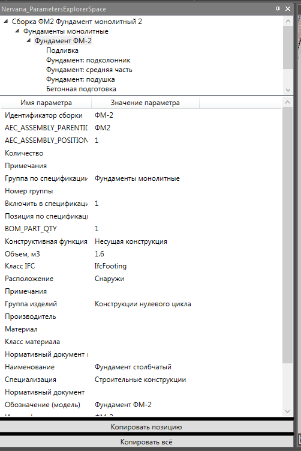

# Обозреватель параметров

*Доступно с версии 1.0.1*

Палитра с отображением структуры параметрического объекта и параметрами для каждой структуры (элемента). Выводится только для тех объектов модели nanoCAD, у которых доступно COM-свойство `Element`.

```csharp
Teigha.DatabaseServices.Entity ent;
IElement? msObject = null;
dynamic entParametric = ent.AcadObject;
try
{
     msObject = entParametric.Element;
}
catch { }

if (msObject != null)
{
   //... работа с msObject
}
```

Палитры выводит структуру и параметры только для одного объекта. При выборе нескольких объектов информация будет выведена только для одного из группы.



Доступны кнопки копирования выбранной строки или всей отображенной информации для одного элемента (позиции в древо-образной структуре в верхней части палитры).

При переходе в новый документ, а также при закрытии данного палитры сбросит отображение информации.

К сожалению, доступа из-под COM API к категориям параметров нет, поэтому параметры внутри элемента идут вперемешку.
