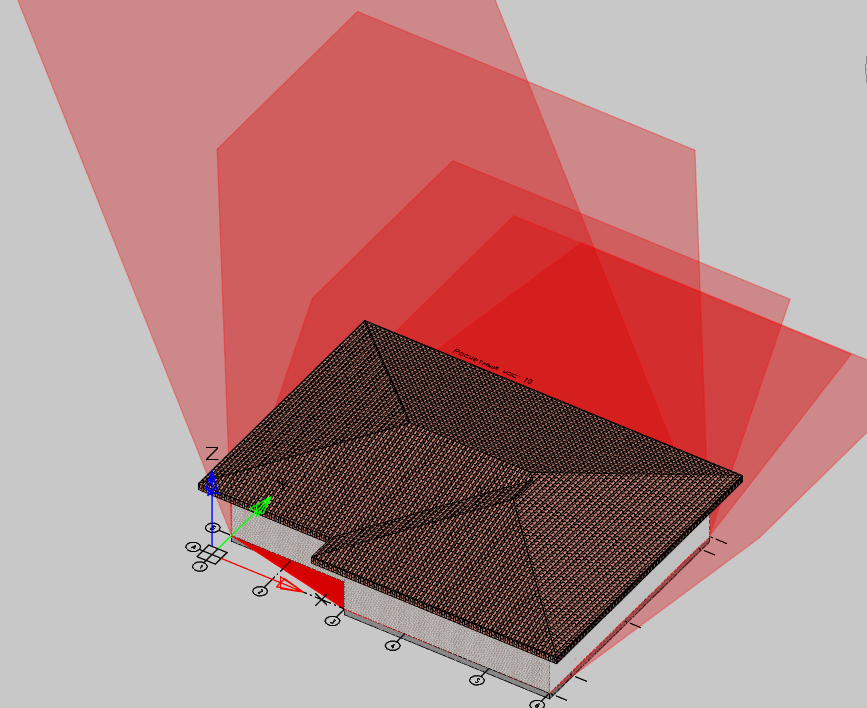

# Построить тени

*Доступно с версии 1.0.1*

Расчет и построение теней (контуры в виде штриховок) от заданных объектов модели (стены, перекрытия, кровля) для заданных положения Солнца, даты.

Исходные данные (целевые широта, долгота в десятичном виде) вводятся из командной строки при запуске команды.

TODO: реализовать ввод данных из формы + указание расчетной даты, смещения часового пояса, отметки над поверхностью земли.

Тени создаются в виде штриховок типа SOLID с красным цветом и прозрачностью 80% (для наглядности перекрытий).
