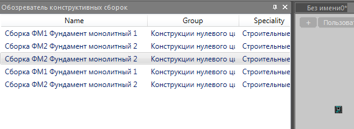

# Обозреватель конструктивных сборок

*Доступно с версии 1.0.1*

Палитра с отображением перечня конструктивных сборок, имеющихся в данном чертеже.

При выборе элемента таблицы (конструктивной сборки) автоматически будет активирован пользовательский ввод точки для вставки выбранной сборки в пространство модели.

Если конструктивная сборка была удалена, то ошибки не будет.

При закрытии документа, переходе в иной документ список сборок будет сброшен и восстановлен для активного документа

# TODO

* при перемещении по позициям перечня осуществлять выбор в модели конструктивных сборок заданного вида;

* по отдельной кнопке производить создание новой сборки данного вида;

* локализовать имена столбцов/или сделать отдельное поле под таблицей с информацией по сборке, оставив в перечне только имена;
