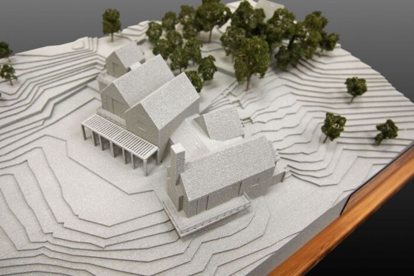
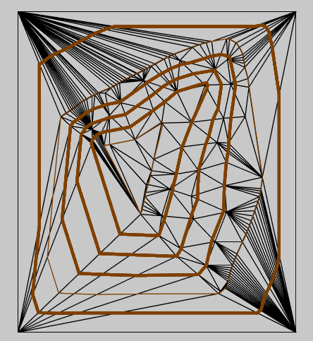
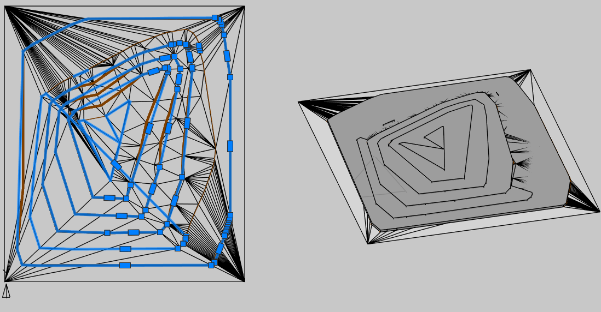

# Концептуальный рельеф

*Доступно с версии 1.0.1*

Команда для концептуального представления рельефа в виде плоскостей с перепадами, представленных перекрытиями. В следующих версиях, возможно, сменю на обычные solid3d.

При разработке команды отталкивался от подобного макета:

# Принцип работы команды

Пользователь должен выбрать в модели объект "Сеть", для которой нужно получить концептуальное представление.

Пользователь должен указать в командной строке величину шага горизонталей (по умолчанию 0.5 метра).

Для выбранной сети запустится расчёт горизонталей с заданным шагом и вычисление замкнутых контуров. Поскольку в общем случае поверхность рельефа строится только для известных данных, то многие горизонтали в нём будут упираться в границу, не образуя замкнутые контуры, поэтому опорная сеть должна иметь границу, одновременно являющуюся и структурной линией (все отметки которой должны быть меньше чем минимальная отметка поверхности), чтобы все горизонтали рельефа образовали замкнутые контуры:

В этом случае результат будет выглядеть следующим образом (слева -- вид сверху для визуального стиля "2D- каркас"; справа -- для визуального стиля "Реалистичный").

Пока не удается добиться, чтобы рисунок всех горизонталей был корректный, но в целом, общая фигура рельефа в виде "террас" близка к верной 
