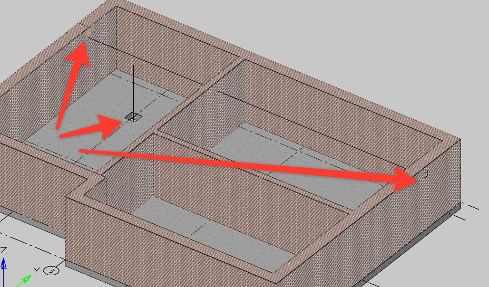

# Расставить отверстия

*Доступно с версии 1.0.1*

Концептуальная реализация команды, позволяющей разместить в стенах и перекрытиях отверстия заданного размера и формы.

Команда работает в бездиалоговом режиме: при запуске просит указать txt-файл с информацией о точках вставки отверстий. Ожидается следующая структура файла (для наглядности, в виде таблицы, разделители колонок -- символ табуляции `\t`), под таблицей приведена запись, ожидаемая в файле

| Handle | Point(XYZ)                | Type      | Size |
| ------ | ------------------------- | --------- | ---- |
| 2683   | 0;9975.4068;2500          | Circle    | 500  |
| 2693   | 16565.5738;9975.4068;2500 | Rectangle | 250  |
| 2737   | 3000;9500;-200            | Rectangle | 500  |

```csv
Handle	Point(XYZ)	Type	Size
2683	0;9975.4068;2500	Circle	500
2693	16565.5738;9975.4068;2500	Rectangle	250
2737	3000;9500;-200	Rectangle	500
```

* **Handle** -- это идентификатор объекта чертежа, уникальный только для данного чертежа. Если чертёж был экспортирован в IFC стандартными инструментами nanoCAD BIM Строительство, то можно восстановить Handle по значению IfcGuid с помощью подхода из [статьи](https://docs.nanocad.ru/articles/nbim-sdk-25-0/i9dffae6f4ae046ed9332aba83f2fe8d7), также handle можно сохранить в значение Параметра простой формулой `=object.Handle`. По умолчанию Handle хранится в виде HEX-числа long, но в данном файле он должен быть в десятичной форме;

* **Point(XYZ)** -- координаты точки вставки отверстия. На стороне программ, осуществляющих проверки на коллизии, например, CADLib, это свойство "Точка коллизии". Указанные координаты будут центром отверстия;

* **Type**-- вид отверстия -- прямоугольное (Rectangle) или круглое (Circle), конечно с инженерной точки зрения круглых отверстий почти нет, но тем не менее этот вариант оставлен;

* **Size** -- размер отверстия в единицах модели (мм). Для прямоугольных отверстия -- Ширина и Высота; для круглых отверстий -- Диаметр;

Если объекта с заданным идентификатором в модели нет, то вставка отверстия будет пропущена. Тип объекта программа определит автоматически. 

Если это отверстие в стене -- то в неё будет вставлен параметрический объект из Библиотеки компонентов (БСК) в зависимости от формы отверстия:

* Rectangle: Проем пустой прямоугольный;

* Circle: Проем пустой круглый.

Если таковые объекты будут отсутствовать в подключенной БСК, то импорт для стен не состоится.

Если отверстия в перекрытии, то будет вырезан контур с размерами Size. Контур только для прямоугольного отверстия (круглое не доступно)



Результат -- примерно такой.
