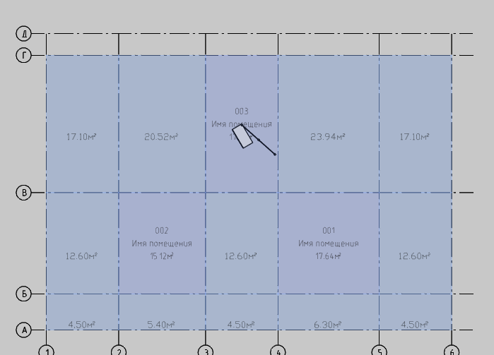
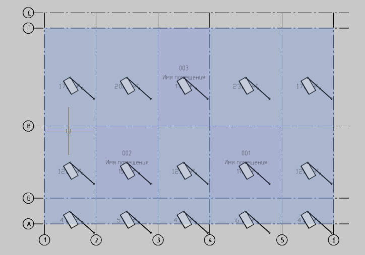

# Расставить в помещениях

*Доступно с версии 1.0.1*

Копирует выбранные параметрические объекты в центры целевых помещений. Бездиалоговая команда.

## Принцип использования

Предполагается, что в модели есть помещения и некоторая группа параметрических объектов.

Сперва необходимо указать копируемые объекты. Затем -- помещения. Можете захватывать рамкой выбора и прочие объекты, в команде стоит фильтр на выбор в первом случае только параметрических объектов, а во втором -- только помещений.

В результате получится:

