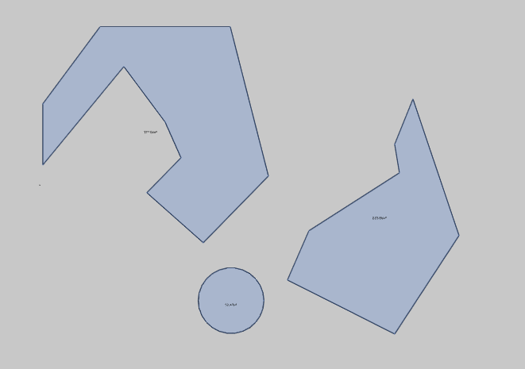

# Авто-контур

Автоматически размещает помещение с параметрами по умолчанию и высотой 3000. 

**Примечание**: команда может не работать, если образующими границы объектами являются параметрические объекты. Например, в Координатной сетке работает, в стенах нет.

После создания помещения Пользователь может выбрать следующий контур и т.д. Прерывание команды через Esc.

(TODO: сделать команду по извлечению базовых линий параметрических объектов -- перекрытий, стен, кровли).
