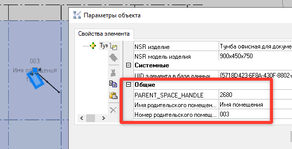

# Связать объекты с помещением

*Доступно с версии 1.0.1*

Команда позволяют передать в атрибуты параметрических объектов, расположенных в помещении, данные о самом помещении. 

**Примечание**: Анализируется только базовая точка объектов. Нормального доступа к иной геометрии через API нет.

## Принцип использования

Бездиалоговая команда.

Ожидает в качестве первой группы объектов анализируемые стены (можно выбрать не только их, в использование попадут только стены).

В качестве второй группы объектов -- анализируемые помещения (можно выбрать не только их, в использование попадут только помещения).

Результат команды:

