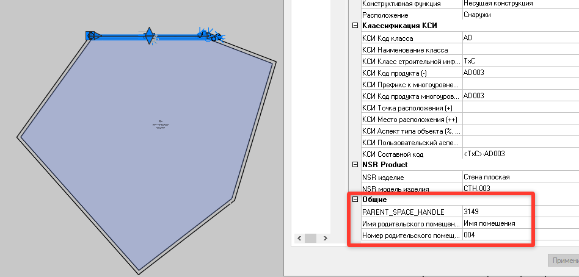

# Связать стены с помещением

*Доступно с версии 1.0.1*

Предварительная реализация команды, позволяющей передать в атрибуты стен данные о помещении, вокруг которых они созданы (актуально для отделки, моделируемой отдельной стеной по контуру помещения).

# Принцип использования

Бездиалоговая команда.

Ожидает в качестве первой группы объектов анализируемые стены (можно выбрать не только их, в использование попадут только стены).

В качестве второй группы объектов -- анализируемые помещения (можно выбрать не только их, в использование попадут только помещения).

Также будет запрошено число "Величина смещения для анализируемого контура помещения", по умолчанию 800.0. Это расстояние смещения базового контура помещения, в области которого должна полностью "поместится" базовая линия анализируемой стены.

Результат команды:

